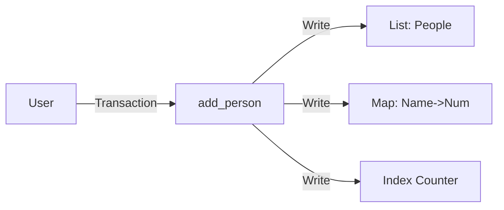

# Vyper 进阶与实战 (Lesson 04-07)

从数据映射到本地开发全流程

<div class="pt-12">
  <span class="px-2 py-1 rounded cursor-pointer" hover="bg-white bg-opacity-10">
    课程 04-07 合集
  </span>
</div>

<div class="abs-br m-6 flex gap-2">
  <a href="https://github.com/vyperlang/vyper" target="_blank"
    class="text-xl slidev-icon-btn opacity-50 !border-none !hover:text-white">
    <carbon-logo-github />
  </a>
</div>

---
layout: intro
---

# 合集概览

<div class="leading-10 opacity-80">

本讲义涵盖课程的后半部分，从数据结构到开发工具的全方位进阶：

- **L04: HashMaps** - 高效的键值对存储与实战
- **L05: 工具生态** - Tenderly 虚拟测试网与 ZKSync 现状
- **L06: 核心逻辑** - EVM 原理、Pure/View 与 If/Else
- **L07: 综合回顾** - Favorites 合约完整复盘与代码分享

</div>

---
layout: section
---

# Lesson 04
## HashMaps 与实战

---

# 为什么不仅用 List?

<div class="grid grid-cols-2 gap-8">

<div>

### 数组 (List) 的局限
- 必须知道 **索引 (Index)**
- 如果数据被删除，索引会变
- 无法通过 "名字" 找人

</div>

<div>

### 映射 (HashMap) 的优势
- 像字典一样查找：`Key -> Value`
- **O(1) 复杂度**：通过名字瞬间找到数据
- 代码可读性更强

</div>

</div>

```vyper
# 声明一个 Mapping
name_to_favorite_number: public(HashMap[String[100], uint256])
```

---

# Workshop 1: 交互挑战

<div class="grid grid-cols-2 gap-8">

<div>

### 任务目标
让 `list_of_people` 在 **Index 3** 的位置存储数据 `(8, "Wong")`

</div>

<div>

### 既然 Index 是自动增长的...
我们需要"手动"推进状态机：

1. **当前**: Index = 1
2. **Tx 1**: 填入任意数据 -> Index 变 2
3. **Tx 2**: 填入任意数据 -> Index 变 3
4. **Tx 3**: 填入 `(8, "Wong")` -> **达成目标!**

</div>

</div>

<div class="mt-8 p-4 bg-green-500/10 rounded-lg">
理解智能合约的<b>状态机 (State Machine)</b> 本质是安全开发的第一步。
</div>

---
layout: section
---

# Lesson 05
## 工具生态 (Tenderly & ZKSync)

---

# 开发环境升级：Tenderly

告别拥堵的公共测试网和坏掉的水龙头

<div class="grid grid-cols-2 gap-8">

<div>

### Virtual Testnets
- **一键 Fork**：复制主网环境
- **无限代币**：想发多少发多少
- **极速确认**：不需要等待挖矿
- **可视化调试**：Tx 执行流一目了然

</div>

<div>

### 使用方法
1. Tenderly 后台创建 Virtual Testnet
2. 复制 RPC URL
3. MetaMask 添加网络
4. Remix 选 "Injected Provider"

</div>

</div>

---

# EVM 与 ZKSync

<div class="grid grid-cols-2 gap-8">

<div>

### 什么是 EVM?
- **以太坊虚拟机**：执行字节码的标准环境
- **兼容性**：Arbitrum, Optimism, Polygon 等都遵守 EVM 标准
- **通用性**：一套 Vyper 代码，多链运行

</div>

<div>

### ZKSync 的特殊性
- **兼容但特殊**：ZKSync 是 EVM 兼容的，但底层由 zkEVM 驱动
- **Remix 限制**：目前的 Remix ZKSync 插件 **不支持 Vyper**
- **解决方案**：未来课程将介绍本地工具链 (Moccasin/Titanoboa)

</div>

</div>

---
layout: section
---

# Lesson 06
## 核心逻辑与修饰符

---

# Pure vs View

不仅是省 Gas，更是语义的清晰

<div class="grid grid-cols-2 gap-8">

<div>

### @view
- **只读** (Read-Only)
- 读取存储变量 (State)
- **不修改**状态
- 链下调用免费

```vyper
@external
@view
def get_num() -> uint256:
    return self.num
```

</div>

<div>

### @pure
- **纯计算** (Pure)
- **不读也不写**存储
- 像数学函数：`f(x) = x + 1`
- 编译器可强力优化

```vyper
@external
@pure
def add(x: uint256) -> uint256:
    return x + 1
```

</div>

</div>

---

# 控制流：If / Else

Vyper 的逻辑控制与 Python 完全一致

```vyper {all|3-4|5-6|7-8|all}
@external
def check_val(x: uint256) -> String[10]:
    if x < 10:
        return "Small"
    elif x < 100:
        return "Medium"
    else:
        return "Large"
```


<div class="mt-4 p-4 bg-yellow-500/10 rounded-lg">
注意：Vyper 此时不支持过于复杂的嵌套循环，保持逻辑简单是省 Gas 的关键。
</div>

---

# Workshop 2: 逻辑实战

<div class="grid grid-cols-2 gap-8">

<div>
### 挑战任务
1. **Add 函数**: 创建一个函数 `add()`，每次调用让 `my_favorite_number + 1`。
2. **修改初始值**: 在 `__init__` 中将初始值设为非 7 的数。
3. **结构体工厂**: 编写函数接收参数，创建 `Person` 结构体并存入列表。
</div>

<div>
### 思考题
如果除数为 0，`x // y` 会发生什么？
(Vyper 会自动 Revert，保护安全)
</div>
</div>

---
layout: section
---

# Lesson 07
## 综合回顾

---

# Favorites 合约完整复盘

<div class="grid grid-cols-2 gap-4 text-sm">
<div class="p-3 bg-gray-800/50 rounded">
<b>Constructs</b>
- HashMaps, Lists, Structs
</div>
<div class="p-3 bg-gray-800/50 rounded">
<b>Variables</b>
- Public State Variables
- Storage vs Memory
</div>
<div class="p-3 bg-gray-800/50 rounded">
<b>Functions</b>
- @external, @view, @pure, @deploy
</div>
<div class="p-3 bg-gray-800/50 rounded">
<b>Logic</b>
- Control Flow, Transactions
</div>
</div>



---

# 分享你的成就

Web3 是一个社区驱动的领域

<div class="grid grid-cols-2 gap-8">
<div>

### 为什么分享？
- **构建个人品牌**
- **连接开发者社区**
- **获取反馈**

</div>
<div>

### 怎么做？
1. 截图你的代码或部署成功画面
2. 发推 Tag **@CyfrinUpdraft** 或 **VyperLang**
3. 庆祝你的第一个智能合约部署！🎉

</div>
</div>

---

# 下一站：本地开发

我们已经榨干了 Remix 的所有潜力。

### 即将到来的新篇章
- **本地环境**：VS Code + Vyper 插件
- **专业框架**：Moccasin (Vyper 的 Foundry)
- **脚本化部署**：自动化、测试驱动开发 (TDD)

[Vyper 文档](https://docs.vyperlang.org) · [Cyfrin Updraft](https://updraft.cyfrin.io)
